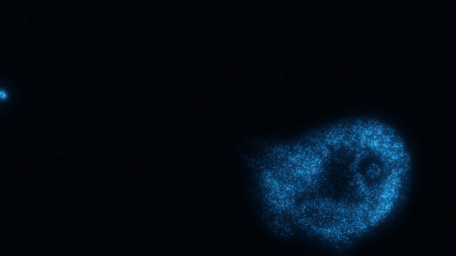
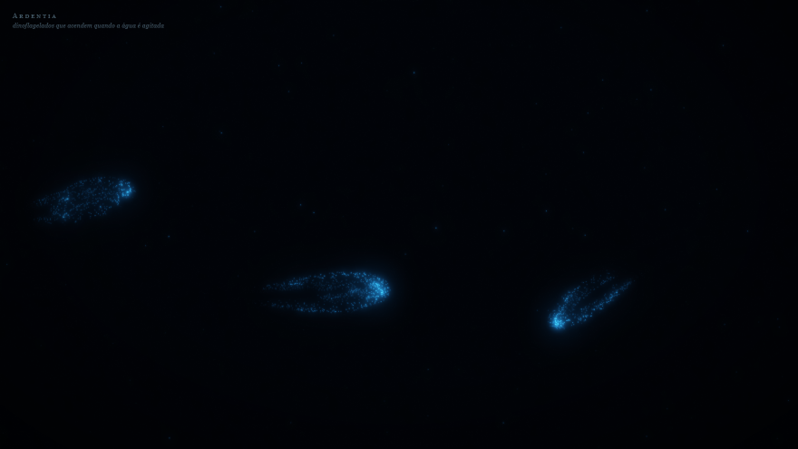
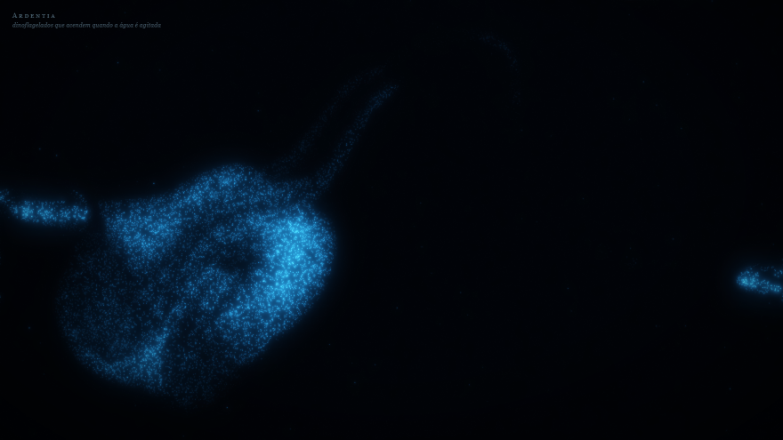

# Ardentia

> *Ardentia*: o nome que os pescadores dão ao brilho que a água solta à noite
> quando o barco corta o mar.

Um mar noturno que roda no navegador. Está tudo escuro — até você encostar na
água.

**[▶ Abrir agora](https://raflael.github.io/ardentia/)** · não instala nada, não
pede nada, não tem servidor



<sub>29 KB de página · nenhuma biblioteca · nenhum passo de build</sub>

## O que está acontecendo aí

A água é simulada de verdade, então o brilho não segue o cursor: ele segue a
**correnteza** que o cursor criou, e continua girando depois que você para.

Quem acende é plâncton — milhares de organismos, cada um com sua reserva de
luz. Passe várias vezes pelo mesmo lugar e ele vai apagando: cada célula gasta
o que tem e leva alguns segundos para refazer o estoque. Volte um minuto
depois e aquele trecho de mar acendeu de novo.

## Os peixes não são desenhados



Não existe imagem de peixe neste projeto. O que existe é um corpo articulado
que empurra a água e esbarra nas células. **A silhueta que você vê é a resposta
do plâncton** — e é assim que se enxerga um cardume no mar de verdade, à noite.

Chegue perto de um com o cursor: ele dispara, e o susto acende o rastro inteiro.

## A biologia é real

Não é enfeite azul. Cada regra na tela é um mecanismo do bicho:

- **O gatilho é o cisalhamento, não a velocidade.** O que dispara o clarão é a
  água *se deformando* e esticando a membrana da célula. Por isso água correndo
  em bloco não acende nada, e a luz nasce nas bordas dos redemoinhos.
- **A luz é um recurso que acaba.** Piscar gasta luciferina, e refazer o estoque
  leva segundos. É isso que faz o mar "cansar" onde você insiste.
- **O clarão é rápido, o apagar é lento**, como o pulso real da célula.
- **O escuro é o estado normal.** Mar parado só solta faíscas esparsas, de
  células que disparam sozinhas.
- **A cor fica perto de 475 nm**, o azul-ciano que essa luciferase emite — o
  comprimento de onda que atravessa melhor a água do mar.

## Como funciona por baixo



- **Fluido de verdade, não ruído animado.** Um solver incompressível
  (*Stable Fluids*, Stam 1999): advecção semi-lagrangiana, projeção por Jacobi
  e confinamento de vorticidade — é o confinamento que segura os redemoinhos
  em vez de deixar tudo virar borrão.
- **Dezenas de milhares de organismos** flutuam nesse campo, cada um com brilho
  e reserva próprios, atualizados na CPU e desenhados como pontos na GPU.
- **A luz é somada em HDR** e passa por um bloom de dois níveis antes de virar
  cor de tela. É daí que vem a sensação de luz: onde muitos acendem juntos, a
  cor caminha de azul a ciano a branco, como na foto de uma onda
  bioluminescente, em vez de estourar num azul chapado.

Três coisas que só apareceram construindo:

1. **Azul puro fica apagado.** A primeira versão parecia poeira. Sem HDR e
   bloom, o azul não vira luz — ele tem luminância baixa demais para o olho.
2. **Empurrar a água com raio largo desenha um anel.** Os peixes viravam
   elipses, porque o cisalhamento se formava na borda do empurrão. O contorno
   só apareceu com o empurrão rente ao corpo.
3. **A ondulação do nado saiu de graça.** O corpo segue a cabeça como uma
   corrente; ninguém animou nadadeira.

## Números medidos

| | |
|---|---|
| organismos em 1600×900 | 49.043 |
| custo da simulação | ~6,8 ms por quadro |
| máquina | i3-10105, 8 GB, gráfico integrado |
| grade do fluido | 132×68 células |
| dependências | 0 |

## Rodar

Abra o `index.html` no navegador — ou [o link publicado](https://raflael.github.io/ardentia/).
Tela cheia (F11) é melhor. Precisa de WebGL2, que qualquer navegador atual tem.

## Testar sem olhar

`requestAnimationFrame` congela no Chrome headless, então a página sabe rodar
em passos fixos e desenhar só o quadro final:

```
index.html?teste=1&t=4                       # 4 s com um dedo traçando a água
index.html?teste=1&t=11&dedo=0               # sem dedo: só os peixes
index.html?teste=1&filme=1&t=4&fps=10        # guarda os quadros para virar GIF
```

No fim ela despeja em `#estat` o número de organismos, o tamanho da grade, o
custo em milissegundos por passo, quantos estão acesos, o cisalhamento máximo e
a reserva média de luciferina. É assim que se ajusta o balanceamento sem
depender do olho — e foi assim que o GIF deste README foi gravado.

## Estado

Nasceu como rascunho, para responder a uma pergunta: *isso impressiona ou não?*

A fazer: onda quebrando na praia com a espuma acendendo; alternar noite e dia,
com o dia virando uma lâmina de microscópio dos mesmos organismos; e acabamento
para o dedo no celular.

## Licença

MIT — veja [LICENSE](LICENSE).
